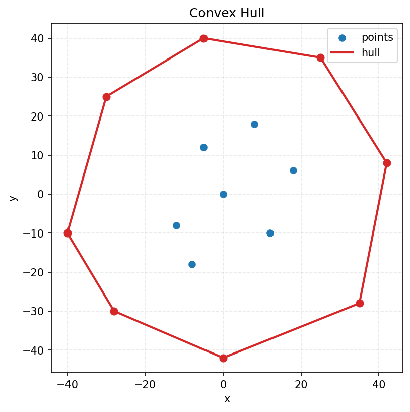

<div align="center">
  <h1>Convex Hull</h1>
  <p><strong>2D convex hull computation and PNG visualization</strong></p>
  
  
  
</div>

---

## Overview

This repository provides a Python implementation of a 2D convex hull pipeline inspired by the Graham paper and accompanying project specification.

The repository includes the following capabilities:

- Compute the convex hull of 2D point sets
- Accept integer and floating-point coordinates through a strict point-like API
- Remove exact duplicates and handle degenerate inputs such as empty, singleton, and collinear sets
- Return hull vertices in cyclic order, rotated so the lexicographically smallest point comes first
- Render points and the resulting hull to a PNG file from JSON input
- Use the implementation both as a Python library and through a small CLI utility

## Scope

This repository targets **2D convex hull computation** only.

- The public library API operates on point-like objects with `x` and `y` attributes
- The JSON array/object input forms are supported by the visualization helper and CLI, not by the low-level `convex_hull()` API directly
- Polygon boolean operations, triangulation, GIS workflows, and 3D geometry are out of scope
- Performance tuning beyond the current implementation and developer visualization is out of scope

## Requirements

- Python 3.11 or later
- `uv` for the recommended locked development workflow
- `make` if you want to use the provided `Makefile` targets
- `matplotlib` only when using the plotting helper or CLI

This project uses a `src/` layout, Hatchling for builds, and `uv.lock` for reproducible dependency sync.

## Setup

Recommended setup:

```bash
make sync
make test
```

Equivalent direct commands:

```bash
uv sync --frozen --group ci --group dev
uv run pytest
```

Main targets:

- `make sync` - Sync locked development dependencies
- `make test` - Run unit tests
- `make ci` - Run the checks used in CI
- `make lint` - Run Ruff checks
- `make format` - Apply Ruff formatting
- `make format-check` - Check formatting without modifying files
- `make typecheck` - Run MyPy against `src`

## CLI

The CLI entry point is `src/convex_hull/cli/plot_convex_hull.py` and is exposed as `convex-hull-plot`.

The CLI reads a JSON point collection and writes a PNG image showing both the source points and the computed hull.

Supported JSON input forms:

- `[{"x": 0, "y": 0}, {"x": 1, "y": 1}]`
- `[[0, 0], [1, 1]]`

### Render a PNG from sample points

```bash
uv run convex-hull-plot points.json output/hull.png
```

### Use a custom title and DPI

```bash
uv run convex-hull-plot points.json output/hull.png --title "Sample Hull" --dpi 200
```

### Run the module directly

```bash
uv run python -m convex_hull.cli.plot_convex_hull points.json output/hull.png
```

### Example `points.json`

```json
[
  { "x": 0, "y": 0 },
  { "x": 2, "y": 0 },
  { "x": 1, "y": 1 },
  { "x": 2, "y": 2 },
  { "x": 0, "y": 2 }
]
```

### Sample output

<div align="center">
    
</div>

If `matplotlib` is not installed, the plotting helper will fail with an explicit message. Install it with `uv sync --group dev` or `pip install .[plot]`.

## Python API

The public package re-exports the main API from `src/convex_hull/__init__.py`, with the core implementation centered on `src/convex_hull/algorithm.py`.

```python
from convex_hull import Point, convex_hull

points = [
    Point(0, 0),
    Point(2, 0),
    Point(1, 1),
    Point(2, 2),
    Point(0, 2),
]

hull = convex_hull(points)

for point in hull:
    print(point)
```

Example output:

```text
Point(x=0, y=0)
Point(x=2, y=0)
Point(x=2, y=2)
Point(x=0, y=2)
```

## Implementation Notes

### Public input contract

`convex_hull(points)` is strict about input shape.

- Each item must expose `x` and `y` attributes
- Coordinates must be `int | float`
- `bool` is explicitly rejected even though it is a subclass of `int`
- Input order is preserved during normalization before later algorithm stages process the data

### Degenerate handling

The algorithm has explicit degenerate-case behavior.

- Empty input returns an empty list
- A single unique point returns a one-point hull
- Two unique points return those endpoints
- All-collinear inputs collapse to the two lexicographic endpoints
- Exact duplicates are removed while preserving first occurrence order

### Output normalization

The final hull is normalized for stable output.

- Hull vertices are returned in cyclic order
- The sequence is rotated so the lexicographically smallest point is first
- Shared tolerances are centralized in `src/convex_hull/constants.py`

### Visualization layer

Plotting is intentionally optional.

- The core library has zero runtime dependencies
- JSON loading and PNG rendering live in `src/convex_hull/visualize.py`
- The CLI is a thin wrapper around that visualization helper

## Testing

This repository includes tests for:

- Public convex hull behavior and acceptance scenarios
- Input normalization and coordinate validation
- Geometry primitives and tolerance-aware orientation logic
- Duplicate removal and degenerate input handling
- Pivot, polar ordering, pruning, and linked-list internals
- CLI behavior and PNG generation flow
- Project metadata such as Python version and dynamic version configuration

Run the full test suite with:

```bash
make test
```

Run the broader local CI set with:

```bash
make ci
```

## Structure

```text
.
├── src/
│   ├── DESIGN.md                      # Source layout notes
│   └── convex_hull/
│       ├── __init__.py               # Public package exports
│       ├── algorithm.py              # Public convex_hull() pipeline
│       ├── cli/                      # CLI entry points
│       ├── constants.py              # Shared numeric tolerances
│       ├── degenerates.py            # Duplicate removal and degenerate handling
│       ├── geometry.py               # Geometry primitives
│       ├── linked_list.py            # Circular list used by pruning
│       ├── normalize.py              # PointLike -> Point normalization
│       ├── pivot.py                  # Interior pivot computation
│       ├── polar.py                  # Polar conversion and angle ordering
│       ├── prune.py                  # Non-extreme vertex pruning
│       ├── types.py                  # Public and internal point types
│       ├── validation.py             # Shared coordinate validation helpers
│       └── visualize.py              # Optional JSON loading and plotting
├── tests/                            # Automated tests
├── docs/                             # Specification and implementation plans
├── Makefile
├── pyproject.toml
├── uv.lock
└── README.md
```

## License

Apache License 2.0 - see [LICENSE](LICENSE).
